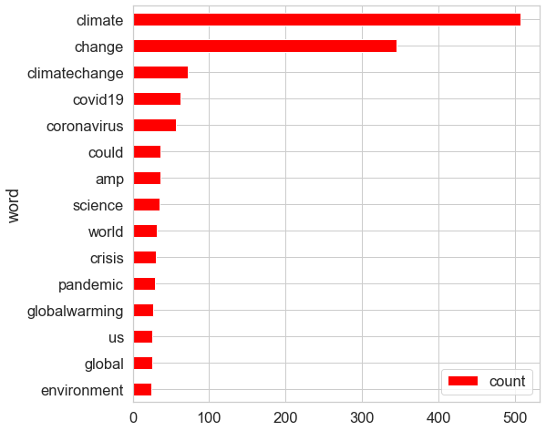
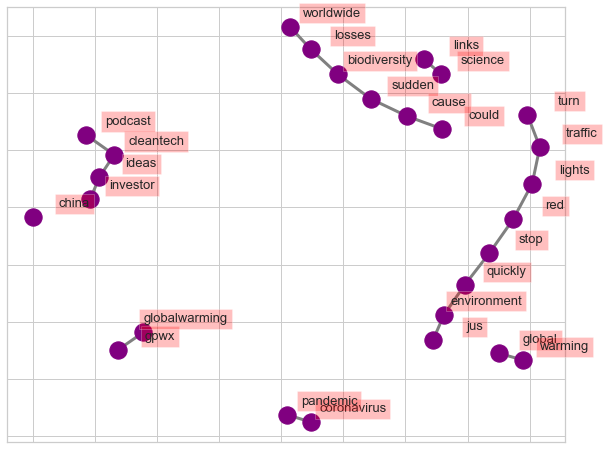
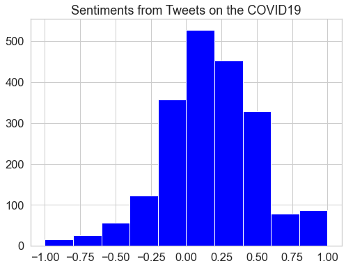

# Twitter_Analytics
Using python Library tweepy and NLP techniques to get insights into temporal and geo-spatial trends and sentiment opinion about Climate Change /Global Warming and COVID19 around the world.

